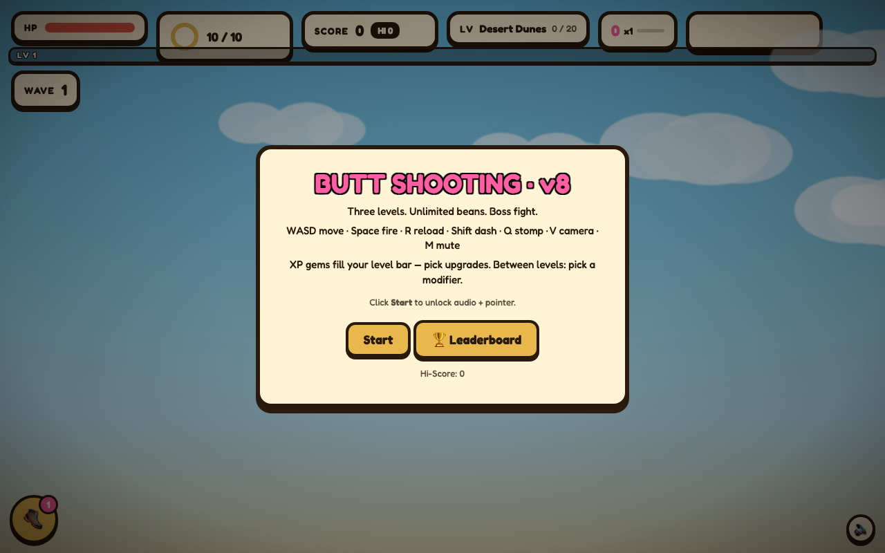
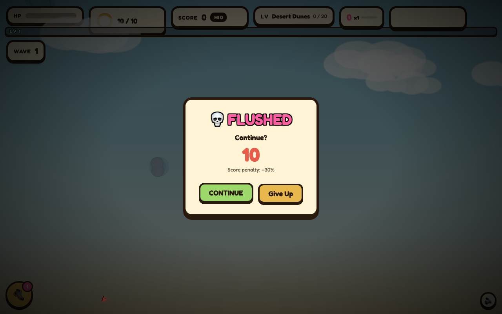

# Butt Shooting Game v8

Arcade-style 3D shooter built with Three.js. Five themed levels, two boss fights, survivor.io-style upgrade loop, combo system, achievement unlocks, mobile touch controls, and analytics — all in vanilla ES modules, no bundler.

Made and iterated by [code-play studio](https://github.com/linnana8888888/code-play) — a multi-agent game studio. Shipped live on [itch.io/cheekshot](https://linnana8888888.itch.io/cheekshot).



## What's new in v8

v8 is the "Session Time & Satisfaction" update — pushes average session from 1.5 min toward 5+ min.

- **Continue screen** — on death, 10s "Continue?" countdown instead of instant game-over; respawn at 50% HP + 2s i-frames + −30% score. One continue per run.
- **End-of-run stats card** — time survived, accuracy %, kill count, best combo multiplier, hi-score on both game-over and win screens.
- **10 achievements** (`achievements.mjs`) — localStorage-persisted with toast notifications: First Blood, Sharpshooter, Combo Master, Survivor (3 min), Boss Slayer, Sewer Diver, Century (1000 pts), Void Walker, Mega Slayer, Second Wind.
- **Tiered combo audio** — distinct escalating sounds per tier: x2 bell → x3 two-note chime → x4 triangle fanfare → x5 full chord burst + noise + sparkle.
- **Wave progression** + expanded screen shake + local leaderboard.
- **Kenney Nature Kit** per-level background scenery.
- **3D backdrop** (`backdrop.mjs`) replaces v7 skydome shader.
- Boss progression bug fix.

Earlier versions: [V7_NOTES.md](V7_NOTES.md) (aesthetic levels — Toxic Swamp, Void Dimension), [V4_NOTES.md](V4_NOTES.md) (XP gems, level-up modal, stomp, modifier roulette), [V8_NOTES.md](V8_NOTES.md) (full v8 spec).



## Play

```bash
python3 -m http.server 8765
# open http://localhost:8765
```

Works on desktop and mobile browsers. ES modules require HTTP — `file://` won't work.

## Controls

### Desktop

| Key | Action |
|-----|--------|
| WASD / Arrows | Move |
| Mouse | Aim |
| Space / Click | Fire |
| R | Reload (auto when empty) |
| Q | Stomp (AoE around player) |
| Shift | Dash (0.6s cooldown, 0.25s i-frames) |
| V | Cycle camera: top-down / chase / FPS |
| \[ / \] | Adjust FPS sensitivity |
| M | Mute (persisted) |
| \` | Toggle analytics panel |
| Esc | Exit pointer lock |

### Mobile

On-screen joystick (left) for movement, FIRE button (right) to shoot, plus RELOAD and STOMP buttons. The game auto-detects touch devices and adapts the HUD.


## Levels

1. **Desert Dunes** — 20 kills to advance. Flushers, buttlings, windies. Cacti and rocks. Sandy floor shader.
2. **Porcelain Lab** — 30 kills. Adds toilet golems. Toilets, pipes, tiles. Grid floor shader.
3. **Sewer Depths** — 40 kills then **Clog King** boss (80 HP, 3 phases). Specular sewer floor shader.
4. **Toxic Swamp** — 50 kills. SwampGas (AoE death), MudCrawlers (group spawn), buttlings. Dead trees, lily pads, toxic barrels. Swamp floor shader.
5. **Void Dimension** — 60 kills then **Mega Clog King** boss (150 HP, 4 phases). VoidShards (teleporting), ShadowClones (mirrors player), buttlings. Crystal shards, void portals. Void floor shader.

Win condition: defeat the Mega Clog King.

## Mechanics

- **Magazine** — 10 beans, 1.2s auto-reload. Unlimited reserve.
- **Combo** — 2s window. Tiers at 5 / 10 / 20 / 40 kills for x2 / x3 / x4 / x5 score.
- **Powerups** — drop from kills: triple shot, rapid fire, speed boost, mega damage.
- **XP gems** — enemies drop gems with magnet pull. Level up to pick from 3 upgrades (damage, speed, reload, extra shots, magnet range, stomp stock, etc.).
- **Modifiers** — roulette before each level adds a run-shaping twist.
- **Warmup dummies** — first 10s of level 1 spawns easy 1-HP flushers for an instant action hook.
- **Healthkit beacon** — pulsing pickup that restores HP.
- **Outfit overlay** — cosmetic variation on the butt.
- **Bean rain** — 5 bean pickups every 30s.
- **Hi-score** — persisted in localStorage.

## Modules

```
index.html            HUD shell, CSS, importmap, overlays (title, picker, continue, gameover)
game.mjs              Main loop, state, levels, enemies, projectiles, continue/stats card logic
player.mjs            Butt model, movement, magazine/reload, input
camera.mjs            Top-down / chase / FPS cycle, pointer lock, sensitivity
audio.mjs             WebAudio SFX + procedural music + v8 tiered combo sounds
scenes.mjs            Level configs, props, enemy builders, per-level shader registry
backdrop.mjs          v8: 3D geometry backdrop per level (replaces v7 skydome)
achievements.mjs      v8: 10 achievements, localStorage persistence, toast notifications
juice.mjs             Floaters, combo, powerups, Clog King AI, bean rain, screen shake/flash/vignette
upgrades.mjs          XP gems, level-up picker, modifier roulette, stats
upgrade_offers.mjs    Early upgrade guarantee, diversity, pity timer
spawn_scheduler.mjs   Warmup dummy phase for level 1
beacon_renderer.mjs   Healthkit beacon visuals
skydome.mjs           v7 legacy gradient skydome (kept for fallback; v8 uses backdrop.mjs)
scenery.mjs           Kenney Nature Kit per-level background scenery (v8)
analytics.mjs         Event log, localStorage rollup, dev panel
```

## Dev hooks (`window.__game`)

```js
__game.setLevel(0|1|2)        // jump to level
__game.forceKill(n)            // force-kill n enemies
__game.spawnBoss()             // spawn Clog King
__game.cameraMode()            // current mode string
__game.mag                     // { cur, max, reloading, ... }
__game.combo                   // { count, tier, mult, timer }
__game.analyticsSession()      // current session rollup
__game.game                    // full state object
```

## Playtest

```bash
python3 -m http.server 8765 &
node playtest.mjs              # screenshots in ./qa/
```

Additional playtest scripts: `playtest_bot.mjs`, `playtest_new_ideas.mjs`, `playtest_v4.mjs`.

## Version history

| Version | Highlights |
|---------|-----------|
| v2 | Initial HTML build + playtest harness |
| v3 | Module split, 3 levels, boss fight, combo, analytics |
| v4 | XP gems, level-up upgrades, stomp, modifier roulette, warmup dummies, healthkit beacon, outfit overlay |
| v5 | Mobile HUD, on-screen joystick, touch fire/reload/stomp |
| v6 | Responsive mobile adaptation, compact phone HUD, scaled touch controls, landscape support, iOS audio fix |
| v7 | Gradient skydome shader, procedural floor shaders, enemy glow pulse + shadow discs, cylinder projectiles + particle trails + hit bursts, muzzle flash, screen flash/vignette/shake, Toxic Swamp level, Void Dimension level, Mega Clog King boss (150 HP, 4 phases), new enemies: swampGas, mudCrawler, voidShard, shadowClone |

## Tech

Built with [Three.js r160](https://unpkg.com/three@0.160.0/) via importmap. No bundler, no framework.
